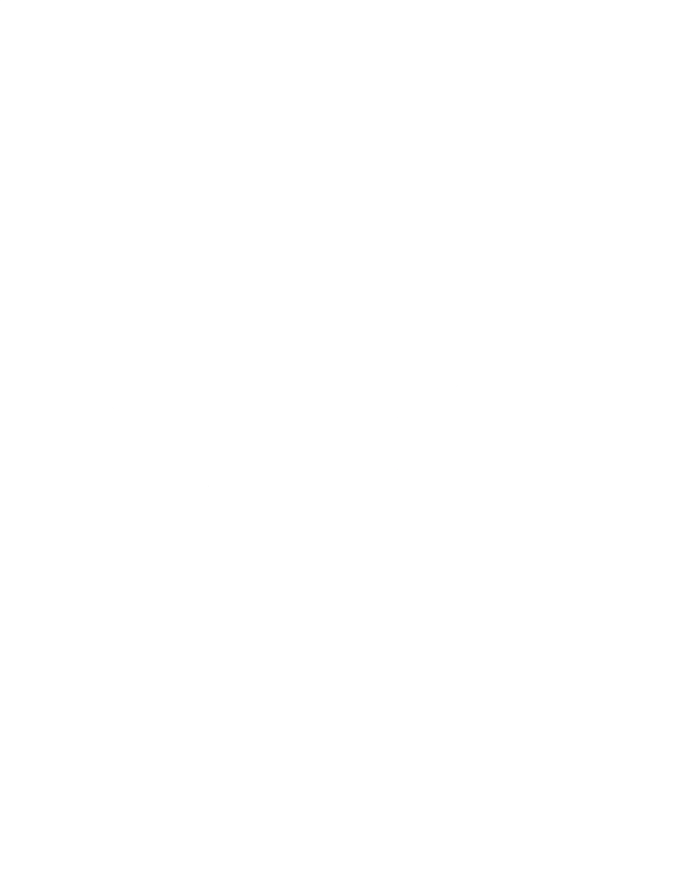

# NexU Campus OS (ERP Platform)

<p align="center">
  
</p>


NexU is a high-performance ERP system designed for college environments. It handles everything from attendance and resource sharing to student lifecycle management. It's built with a focus on security, speed, and a sleek dark aesthetic.

## Key Features

### 1. Enrollment Security (Whitelist System)
No more fake accounts. For a student or teacher to join, their email must first be authorized by an admin via a CSV master list.
*   **Admins** upload a CSV to the dashboard.
*   **Signup** checks this list before allowing registration.
*   **Prevention**: Unauthorized users are blocked from even creating an account.

### 2. Automated Student Lifecycle
The system manages itself. Every 24 hours, a background maintenance worker runs to:
*   **Auto-Semester Upgrade**: Moves students up (e.g., from Sem 1 to Sem 2) based on the academic calendar (Jan-June / Aug-Dec).
*   **Automatic Graduation**: Once a student hits 8 semesters (4 years), their role is automatically switched to `graduated`.
*   **Dual-Sync**: Updates both the Postgres database (relational) and ScyllaDB (search index) simultaneously.

### 3. Teacher Access Control
Teachers aren't just "given" a class. Admins must explicitly assign them to subjects or designate them as "Home Teachers."
*   **Subject Access**: Teachers can only upload resources for subjects they actually teach.
*   **Home Teacher Status**: Grants permission to see the full attendance report for a specific section.

### 4. Admin Dashboard
A centralized hub for college management:
*   **Bulk Onboarding**: Upload CSVs for students and teachers.
*   **Hardware Integration**: Link physical RFID UIDs to faculty profiles for hardware-based attendance.
*   **Directory Management**: View everyone's attendance percentage, academic info, and resumes.

---

## Technical Setup

### Prerequisites
*   **Docker Desktop**: Required for the database cluster.
*   **Rust (Cargo)**: For the backend.
*   **Node.js**: For the React frontend.

### Quick Start
Just run the batch file in the root directory. It handles the database startup, health checks, and boots both the frontend and backend.
```powershell
./start.bat
```

### Environment Variables (.env)
Make sure your `.env` is set up. Key variables include:
*   `DATABASE_URL`: Postgres connection string.
*   `SCYLLA_NODES`: Comma-separated list of ScyllaDB nodes.
*   `SESSION_TTL_HOURS`: How long a user stays logged in.
*   `MAX_API_BODY_BYTES`: Limit for file uploads (defaults to 20MB).

---

## Project Structure
*   `/backend`: Rust (Axum) source code.
*   `/frontend`: React + Vite + Vanilla CSS.
*   `docker-compose.yml`: Defines the ScyllaDB cluster, Postgres, MinIO, and Meilisearch.

## Detailed Documentation
*   [Architecture Overview](docs/architecture.md)
*   [Database Schema](docs/db_schema.md)
*   [Release Notes](docs/release_notes.md)
*   [UI system](docs/ui_system.md)

## License

Proprietary License. Strictly for private use only. Unauthorized copying, distribution, or reverse engineering will lead to severe legal consequences.

---
*Built with care by the Xena-devs.*
